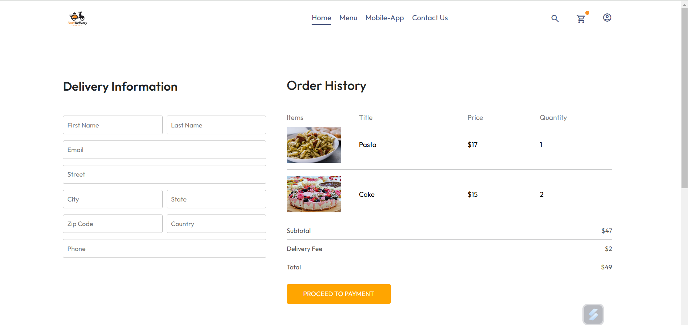

# Food Delivery App

A full-stack food delivery app built with **React.js**, **Node.js**, **Express**, **MongoDB**, **JWT** for authentication, and **Bcrypt** for password hashing. This project allows users to browse a menu, add items to the cart, and place orders. The admin panel allows admins to manage the menu, view orders, and add new items.

## Features

### Frontend (User Side):
- **Home Page**: 
  - Filter the menu and view all available food items.
  - Click on any item card to see the details.
  - Add items to the cart and select quantity.
  
- **Cart Page**:
  - View added items with title, image, price, quantity, and total amount.
  - Display delivery charges and total cost.
  - Proceed to place the order.
  
- **Order History Page**:
  - View the list of past orders with details such as the amount to pay and the items in the cart.
  - Submit orders to the admin.

### Backend (Admin Side):
- **Admin Panel**:
  - **Add Page**: Admin can add new items to the menu.
  - **List Page**: Admin can view all menu items and remove items.
  - **Order Page**: Admin can view orders received from users.

### Authentication:
- JWT-based authentication for secure login and access control.
- Bcrypt for hashing passwords.

## Technologies Used
- **Frontend**: React.js
- **Backend**: Node.js, Express
- **Database**: MongoDB
- **Authentication**: JWT, Bcrypt

## Installation

### Prerequisites
- Node.js
- MongoDB instance (can be a local or cloud MongoDB database)

### Steps to Run the Project

#### 1. Clone the Repository
```bash
git clone "https://github.com/Ayushi9521/food-delivery-app"

#### 2. Install Dependencies for Backend
Navigate to the backend directory:
cd backend

Install the dependencies:
npm install

####3. Install Dependencies for Frontend
Navigate to the frontend directory:
cd frontend

Install the dependencies:
npm install


####4. Set Up Environment Variables
Create a .env file in both the frontend and backend directories to configure environment variables like your JWT secret key, MongoDB URI, etc.

Example .env for backend:
MONGO_URI=your-mongo-uri
JWT_SECRET=your-jwt-secret
PORT=5000

####5. Run the Project
Backend:
cd backend
npm start

Frontend:
cd frontend
npm start


## Screenshots

### Home Page


### Cart Page


### Order History Page


### Admin Panel


